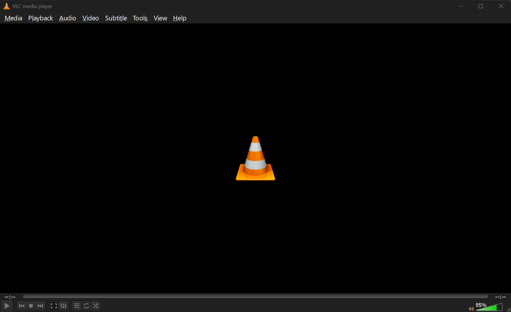

# VLC Dark Theme for Windows

A dark theme for **VLC media player 3.0.x on Windows** that keeps **every feature**, and a fix for tiny controls on **4K / HiDPI** screens.

This is **not a skin**. VLC skins (`.vlt`) replace the interface with a simpler one and drop features. This project switches on VLC's own hidden dark palette on the standard interface. You keep every menu, the playlist, Effects & Filters, the equalizer, subtitle tools, Convert/Stream, Preferences and all keyboard shortcuts.

## Features
- 🌙 **Dark interface** that uses VLC's built-in `qt-dark-palette`
- 🎨 **Fusion style**, so the dark colours apply to every dialog and widget, not just some
- 🖥️ **Bigger controls on 4K**: the toolbar, seek bar and menus are scaled up 1.25× by default, and you can change the amount
- ↩️ **Revert with one command**, and your original config is backed up automatically
- ✅ **No feature loss**: it is the standard VLC interface, recoloured

## Screenshot


*VLC 3.0.24 with the dark palette, the Fusion style and `-Scale 1.25` on a 4K monitor at 150% Windows scaling.*

## Requirements
- Windows 10 or 11
- VLC 3.0.x (tested on **3.0.24**). The dark palette option is not in older 3.0 builds.

## Install
1. **Close VLC** completely.
2. Clone or download this repo.
3. Run:
   ```powershell
   powershell -ExecutionPolicy Bypass -File apply.ps1
   ```
4. Start VLC again. If it opens from a file and still looks small, **sign out and back in** once, because Explorer only picks up new environment variables after that.

### Change the size
```powershell
powershell -ExecutionPolicy Bypass -File apply.ps1 -Scale 1.5   # larger
powershell -ExecutionPolicy Bypass -File apply.ps1 -Scale 1     # dark theme only, no extra scaling
```
The default is `1.25`. On VLC 3, Windows already scales the text but not the toolbar icons. `-Scale` enlarges everything, text included, so values above about `1.5` make menus and dialogs very large.

## Uninstall
```powershell
powershell -ExecutionPolicy Bypass -File revert.ps1
```
This restores the light theme and removes the scaling variables. A copy of each original config file is also saved in `backups/`, a local folder that git ignores.

## Manual setup (no scripts)
1. In VLC, open **Tools → Preferences → Interface**.
2. Set **Style** to **Fusion**.
3. Tick **Use a dark palette**.
4. Click **Save** and restart VLC.
5. For bigger controls on 4K, add the user environment variable `QT_SCALE_FACTOR=1.25` (Start → "Edit environment variables for your account"), then sign out and back in.

## How it works
| Setting | Where | What it does |
|---|---|---|
| `qt-dark-palette=1` | `%APPDATA%\vlc\vlcrc` | Turns on VLC's built-in dark palette |
| `QtStyle=Fusion` (`[MainWindow]`) | `%APPDATA%\vlc\vlc-qt-interface.ini` | Uses the Qt Fusion style, which fully respects the palette |
| `QT_SCALE_FACTOR=1.25` | User environment variable | Makes the whole Qt interface bigger, toolbar icons included. This is what fixes the tiny controls |
| `QT_AUTO_SCREEN_SCALE_FACTOR=1` | User environment variable | Asks Qt to scale by monitor DPI. VLC 3.0.24 ignores it for the toolbar, but it does no harm and may help other Qt apps |

## Troubleshooting
- **Theme reset after running the script:** VLC was still open and wrote its old settings back when it closed. Close VLC (check the system tray too) and run `apply.ps1` again.
- **Still tiny on 4K:** sign out and back in, or restart, so new programs see the environment variable. Then try `-Scale 1.5`.
- **Other Qt apps look larger too:** both variables apply to every Qt 5 app for your user, not just VLC. Use a smaller `-Scale`, or run `revert.ps1` to remove them.

## License
MIT
